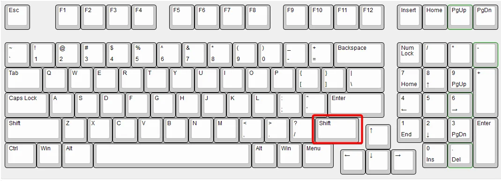

<!--meta
id: guide-rightshift-menu
type: guide
title: RightShift-Menü (V3) öffnen
tags: [ui, menu, clickgui, keybind, v3]
keywords: [rightshift, rshift, right shift, menu, menü, clickgui, click gui, v3, öffnen, open, keybind, taste]
solution_summary: Mit der RightShift-Taste (rechts, unter Enter) öffnest du das NRC-V3-Menü.
-->

## Wie öffne ich das RightShift-Menü (V3)?

Drücke die **RightShift-Taste** — das ist die **rechte Shift-Taste**, direkt
**unter der Enter-Taste**. Damit öffnet sich das NoRiskClient-V3-Menü.

### Tipps

- **Einmal drücken** → Menü öffnet sich (kompakte Overlay-Ansicht).
- **Doppelt drücken** → klappt direkt in die volle Ansicht auf.
- **Linke Shift + RightShift** → springt sofort in die volle Ansicht.

### Taste ändern

Der Standard-Keybind heißt **`norisk.ui.modules`** und ist auf RightShift gelegt.
Du kannst ihn in den NRC-Keybind-Einstellungen auf eine andere Taste umbinden,
falls RightShift bei dir belegt ist.
